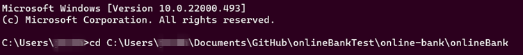
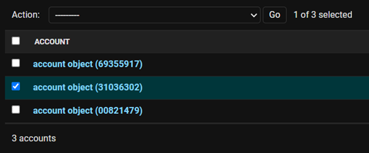
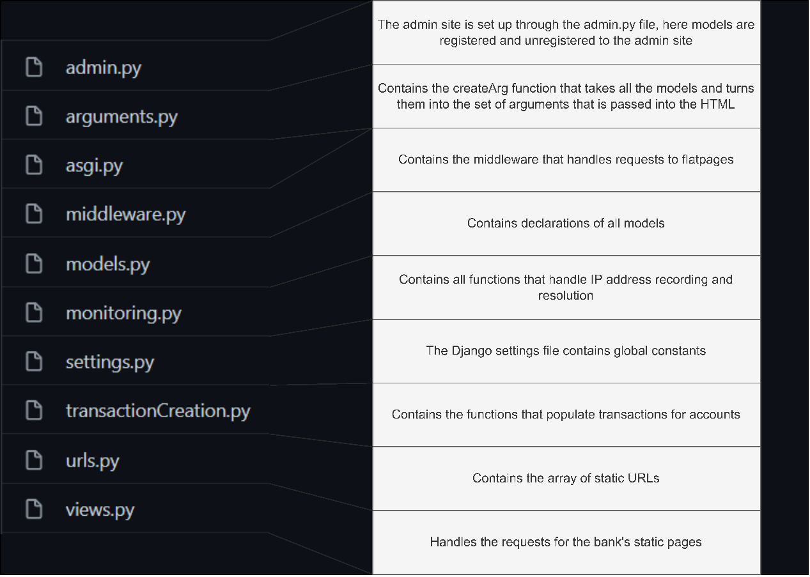

# OnlineBank

An online bank framework for the rapid creation and customisation of a fake online bank for the purposes of scambaiting.

## Online Bank User Guide

### Install
The project is hosted on a public GitHub Repository named onlineBank. It can be accessed using the link:
https://github.com/c1923036/onlineBank

### Local Setup
Setting up the server locally is a simple yet effective approach to using the framework. The majority of the functionality is retained, the notable difference with this setup is that the webserver is hosted locally and will only be accessible from inside your network, therefore the scammer will not be able to directly access the bank from their computer. This is still effective however since most scammers will interface with the bank through your computer.
Once you have installed and extracted the files, if necessary, the first step is to enter the onlineBank directory, inside this directory you should see a file called manage.py. Click on the search bar at the top of the file explorer and copy the path to your current directory.
The next step is to open a terminal, we shall use the Windows Command Prompt. To open the Command Prompt, press the Windows Key, then type into the search “cmd” and press enter. Cmd.exe should appear on your screen. You then want to type into the terminal “cd ” and then right-click to paste the path into the terminal. You should have something that looks like this:


Press the enter key and you should enter the directory you were previously inside with the file explorer.
You should now be ready to start the webserver. You can do this by entering the command
```
$ Python3 manage.py runserver
```
The server should now start running. You can test it by opening the following link in your web browser of choice.

http://127.0.0.1/

You should now be able to see the default homepage of the bank.
There are several pages you can visit from here to help you get to grips with the default capabilities of the bank. 
- 127.0.0.1/about – Example flatpage
- 127.0.0.1/login – Log in page (example username: “johnDoe” password: ”Csc*123456”)
- 127.0.0.1/admin – Admin log in page (default username: “csc” password: “csc”)

From the login page, the user can view the accounts pages and their functionality. The admin panel is where all basic customisation can be conducted.

### Elastic Beanstalk (EB) Setup
There are many benefits to a publicly hosted deployment of the OBF the largest of which is that the webserver can be accessed by anyone.
Before any work can be done there are minor changes that must be made to a file to toggle the Django interface from a private facing to a public. These changes are in the file settings.py By default, the following lines will not be commented and need to be commented out by putting a # symbol at the start of lines:
- 26
- 129
- 130
- 131

Meanwhile, line 127 must be uncommented by deleting the # symbol at the start of the line.
To change back from a public-facing implementation to a private setup simply reverse these changes.
Additional changes you should make to the settings.py file are to replace the security_key value on line 23, this should be set to a random string of your choosing, and set the DEBUG value on line 26 to ‘False’.

Prerequisites
•	Your copy of the OBF
•	An Amazon Web Services (AWS) account
•	Python 3.7 or later
Additionally, several Python packages are required
o	Pip
o	Awsebcli
Please note that if you have made changes to the OBF that involve importing new modules please update the requirements.txt file such that new imports will be carried across to EB.
The first step that must be made is to locate yourself in the correct directory. First open your terminal of choice, PowerShell, Windows Terminal, cmd, etc. With your terminal, direct yourself into the onlineBank directory, the file manage.py should be in the same directory.
```
$ cd onlineBank
```
The next step is to create your EB CLI repository. This can be done with the command, note that OBF may be swapped out for whatever you wish you call the repository:
```
$ eb init -p python-3.7 OBF
```
If this is your first time using Awsebcli you will be required to enter credentials at this stage.
The next step is to create an environment to deploy your application. This is done with the command:
```
$ eb create OBF-env
$ eb status
```
This will take approximately 5 minutes; however, you can monitor the progress using the eb status command. Finally, execute the deploy command to start the webserver running your version of the OBF:
```
$ eb deploy
```
Once complete you can either use the eb status command again to find the allocated domain or you may wish to use the eb status command to find the deployment’s CNAME value, this is the domain that has been allocated to your deployment. Alternatively, you can execute the eb open command to automatically open the domain:
```
$ eb open
```
If everything worked correctly your instance should now be hosted on a webserver accessible to anyone in the world.

### Basic Customisation
All basic customisations can be conducted from the site’s admin panel. To log into the admin panel the server must first be running. The admin panel is accessed with the link http://<your_domain>/admin where your_domain is either 127.0.0.1 or your EB domain. There is a default user named “csc” with the password “csc” which can be used for initial access to the admin panel.
There is a range of models within the admin panel that can be created and customised to change elements of the fake bank.

#### Users
The users model holds the users that can be used to log into the admin panel or the accounts section of the site. If you want to create an account for scambaiting come up with a fake name to use and create yourself an account. Once you’ve done this you can test it out by attempting to log in at http://<your_domain>/login.

#### MySite
The site model holds the overarching variables for your fake bank. Here you can configure your bank's name, logo, primary colours and much more.

#### MyFlatpage
The MyFlatpages model is for holding your own custom pages on the site. You can configure where on the site you want the page to appear with the URL field, if you want it to appear on the navbar, and or the footer. Fundamentally, you can enter your own custom HTML to appear on the page.

#### outerTemplate and innerTemplate
The outerTemplate model is an HTML upload that allows a user to apply and add a template to their site. The outer template represents the sections of the HTML page that should appear sitewide. As can be seen in the example below the outer template is made up of a header, footer and margins.
The innerTemplate is also an HTML template upload allowing a user to apply a template to a flatpage. The inner template sits within the outer template and is applied on a page-by-page basis. As can be seen in the example below the innerTemplate is the centre of the page excluding the margins.


 
#### logo
The logo model is an opportunity for a user to change the site’s logo. The logo model allows users to upload images, the site’s logo can then be set by selecting the image from the site model.
Applying a Logo:
1.	Select a logo, preferably a PNG with a transparent background.
2.	Log in to the admin panel and select the logo model.
3.	Press the add logo button.
4.	Give your logo a name by which it will be referenced.
5.	Upload the image file you wish to use as your logo.
6.	Press the save button to save the instance of the logo.
7.	Now navigate to the MySite model on the admin panel.
8.	Select the instance of the site which you are currently using (look which instance matches your URL).
9.	Click the logo field and select the logo you just uploaded.
10.	Save the model and refresh the bank. The logo should now appear on your site

#### font
The font model enables users to upload custom font files for use on their online bank. Font files can be downloaded from Google fonts and uploaded in the Zip format as they come. The desired font can then be selected from the site model.
Applying a Font:
1.	Select a font, the Google Fonts web helper is useful for this: https://google-webfonts-helper.herokuapp.com/fonts. Download the font, it should be in a ZIP file. Do not extract the ZIP file.
2.	Log in to the admin panel and select the font model.
3.	Press the add font button.
4.	Give your font a name by which it will be referenced.
5.	Upload the font ZIP file you downloaded.
6.	Press the save button to save the instance of the font.
7.	Now navigate to the MySite model on the admin panel.
8.	Select the instance of the site which you are currently using (look which instance matches your URL).
9.	Click the font field and select the font you just uploaded.
10.	Save the model and refresh the bank. The font should now appear on your site

#### staticFile
The staticFile model is a more advanced customisation feature. If creating custom templates that reference local resources such as images those resources must be accessible to the online bank. The staticFile model allows users to upload resources which can then be referenced as static files.
account
Each instance of the account model represents a bank account. The model is attached to a user and when the user logs into the bank they will have all the instances of the account model displayed. Each account comes with the variables balance, account number and sort code.
Populating an Account with Transactions
1.	Log in to the admin panel and select the account model.
2.	Select the account you wish to populate by checking the accounts checkbox.



3.	On the action box select the action, “Populate Transactions for Selected Accounts”.
4.	Press Go.
transaction
The transaction model represents all the transactions within the bank. Each instance of the model represents one transaction. A transaction comes attached to an instance of the account model and contains all the necessary transaction details, where the money is going or where it has come from, the amount, date, and reference.

#### ip
The ip model is related to recording as much information about scammers as possible. Unlike other models that are focused on users inputting data through the admin panel, the ip model is a data output model. IP addresses that access the site are recorded and resolved through the IPInfo API, adding location data to the model.
Setting up IP Address Resolution
The IPInfo API is a free API enabling users to enter an IP address and be returned a rough location of the IP address. Whilst the API is free, it requires an API key and users must create an account to acquire a key.
1.	Go to https://ipinfo.io/signup.
2.	Create an account.


4.	Select token and copy your access token to your clipboard.
5.	Open the file onlineBank/settings.py.
6.	Paste the token into the field, IP_INFO_ACCESS_TOKEN.

### Advanced Customisation
More advanced customisation of the site is possible however this requires more pre-requisite knowledge. A user may for example wish to add an entirely new model, some steps should be followed to make these changes.
It is important for users who wish to make more advanced changes to understand where the sections of code are located. The diagram below outlines what each file within the onlineBank directory contains.
 

 
If models are created, edited, or deleted some steps should be taken to update the SQLite database.
First, a terminal should be opened in the onlineBank directory the user must then execute two commands.
```
$ python3 manage.py makemigrations
$ python3 manage.py migrate 
```
Unless there are issues with the changes made to the models the database will update, applying the changes.

